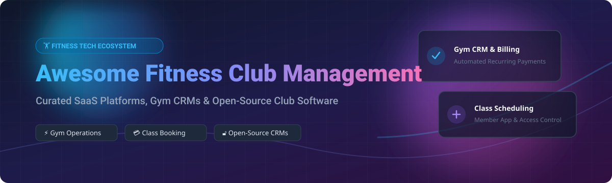

# 🏋️ Awesome Fitness Club Management Software & Ecosystem 🏋️‍♂️

  
  
  
  

## 📌 Executive Overview & Top Fitness Club Platforms

A curated list of top **SaaS products**, **gym software platforms**, and **open-source fitness management projects** for commercial gyms, health clubs, boutique fitness studios, CrossFit boxes, and wellness centers. 

Whether you are looking for an enterprise fitness club management system (FCMS), a self-hosted open-source gym CRM, class booking software, automated membership billing, or member portal access control, this repository covers the entire software ecosystem.

> **Updated:** September 2026

---

## 📑 Table of Contents
- [🏢 Fitness Club Management Market Analysis](#-fitness-club-management-market-analysis)
- [💻 Commercial SaaS Platforms](#-commercial-saas-platforms)
- [🔓 Open-Source GitHub Projects](#-open-source-github-projects)
- [🛠️ Key Features Comparison Framework](#%EF%B8%8F-key-features-comparison-framework)
- [🤝 How to Contribute](#-how-to-contribute)
- [💖 Support & Sponsorship](#-support--sponsorship)
- [📈 Star History](#-star-history)
- [⚠️ Disclaimer](#%EF%B8%8F-disclaimer)

---

## 🏢 Fitness Club Management Market Analysis

> 📊 **Market Size & Structure:** The global **Gym & Fitness Club Management Software Market** is estimated at **$1.8 Billion - $2.2 Billion**, projecting to grow to over **$3.8 Billion by 2032** at a ~9.5% CAGR. 
> 
> 🧩 **Market Concentration:** The market is **moderately fragmented**, with a dominant enterprise leader (**Mindbody / ClassPass / ABC Fitness**) holding substantial market share in large chains and boutique enterprise studios, while dozens of specialized SaaS platforms (**Wodify**, **PushPress**, **Zen Planner**, **Glofox**) compete aggressively across niche verticals like CrossFit boxes, martial arts academies, and local fitness studios.

---

## 💻 Commercial SaaS Platforms

The following tabular breakdown ranks leading commercial fitness management SaaS platforms by estimated **company size (Revenue / Valuation)** alongside transparent pricing tiers and free trial/plan limits.

| Platform | Enterprise Scale (Revenue / Valuation) 📈 | Base Starting Price 💳 | Free Plan / Trial Limits ⏳ | Key Focus & Specialization 🎯 |
| :--- | :--- | :--- | :--- | :--- |
| **[Mindbody](https://www.mindbodyonline.com/)** | **~$500M Revenue** / ~$3.0B Valuation (Acquired by Vista Equity) | $139/month (Starter tier) | No free plan; Demo request required | Enterprise wellness, multi-location boutique studios, spas, & global marketplace |
| **[ABC Fitness](https://www.abcfitness.com/)** | **~$300M Revenue** / ~$3.0B Valuation | $149/month (Quote-based scaling) | No free plan; Custom sales demo | Enterprise health club chains, multi-site franchises, & large-scale billing operations |
| **[Glofox](https://www.glofox.com/)** *(by ABC Fitness)* | **~$20M Revenue** / $200M Acquisition Valuation | $110/month (Starter tier) | 14-day free trial available | Boutique fitness studios, gym franchises, class booking & branded custom apps |
| **[ClubReady](https://www.clubready.com/)** | **~$31.1M Revenue** (Acquired by Clubessential) | $149/month | No free plan; Consultation & custom demo | Fitness club chains, membership retention, sales lead automation & staff management |
| **[PushPress](https://www.pushpress.com/)** | **~$15M Revenue** / $32.6M Total Funding | $0/month (Free Core Tier) | **Free Forever Plan** (Core tier up to 100 members); 14-day Pro trial | Independent gyms, CrossFit affiliates, automated billing & community management |
| **[Wodify](https://www.wodify.com/)** | **~$9.7M Revenue** | $99/month | 14-day free trial | CrossFit boxes, functional fitness, WOD tracking & athlete performance logging |
| **[TeamUp](https://goteamup.com/)** | **~$8.5M Revenue** | $69/month (up to 50 active members) | 14-day free trial | Class-based fitness studios, personal trainers, appointment & schedule management |
| **[Zen Planner](https://zenplanner.com/)** | **~$6.8M Revenue** | $117/month (up to 50 members) | No free trial; Scheduled live demo | Martial arts schools, gymnastics, box fitness, & membership auto-billing |
| **[Pike13](https://www.pike13.com/)** | **~$3.4M Revenue** / $16.8M Valuation | $139/month (Essential plan) | 7-day free trial | Swim schools, music academies, and activity-based fitness business scheduling |
| **[PerfectGym](https://www.perfectgym.com/)** | **~$3.0M Revenue** (Acquired by Sport Alliance) | €99/month (~$108/mo) | Demo request; No self-serve trial | Multi-location fitness centers, RFID access control, & enterprise business intelligence |

---

## 🔓 Open-Source GitHub Projects

For gym owners, self-hosters, privacy-conscious operators, and developers looking to build custom fitness club management software, the following open-source solutions provide community-maintained codebases. Sorted by GitHub Stars_Count.

- **[wger](https://github.com/wger-project/wger)**  
    
  *AGPL-3.0 License (Python/Django & Vue.js)*  
  A full-featured, self-hostable FLOSS workout, exercise, nutrition, and personal training manager with multi-user gym administration and REST APIs.

- **[laragym](https://github.com/johndavedecano/laragym)**  
    
  *MIT License (PHP/Laravel & Svelte)*  
  Modern open-source gym management application built with Laravel and Svelte for handling members, subscriptions, and daily gym operations.

- **[GYM-One](https://github.com/mayerbalintdev/GYM-One)**  
    
  *Open Source (PHP)*  
  Open-source gym management system designed for fitness centers—covering membership ticketing, class scheduling, and payment tracking.

- **[MotionGym](https://github.com/cristianmarint/MotionGym)**  
    
  *MIT License (PHP/Laravel & Voyager)*  
  An open-source administration panel and membership management platform tailored for gyms and athletic clubs.

- **[Titan-Gym](https://github.com/RocktimRajkumar/Titan-Gym)**  
    
  *Open Source (PHP/MySQL)*  
  Lightweight gym management portal enabling real-time member records, subscription tracking, and administrative controls.

- **[Gym-Member-Management](https://github.com/smahesh29/Gym-Member-Management)**  
    
  *Open Source (Python/Django)*  
  Web application created with Django to automate gym member check-ins, fee collections, and subscription renewal alerts.

- **[GymMaster (MERN Stack)](https://github.com/abhishekrajput-web/GymMaster)**  
    
  *MIT License (JavaScript/MERN Stack)*  
  Responsive MongoDB, Express, React, and Node.js management application designed for gym memberships and fitness plans.

---

## 🛠️ Key Features Comparison Framework

When evaluating or building a **Gym Management System (GMS)**, ensure your solution satisfies these core operational modules:

1. 💳 **Automated Membership Billing:** Support for recurring subscriptions, Stripe/Square integration, failed payment retries, and invoice generation.
2. 📅 **Class Scheduling & Booking:** Interactive calendars, capacity limits, waitlists, and attendance logging for group fitness.
3. 🔓 **Hardware & Access Control:** Integration with RFID turnstiles, barcode scanners, or QR code check-in kiosks.
4. 📊 **Member Portal & Mobile App:** Branded iOS/Android or PWA interfaces for workout logging, progress tracking, and booking.
5. 📈 **Business Analytics & Churn Prediction:** Financial reporting, active member metrics, attendance stats, and retention marketing.

---

## 🤝 How to Contribute

Contributions are welcome! Please follow these simple guidelines:

1. 🍴 Fork the repository.
2. 📝 Add or update entries in `README.md` maintaining table/markdown formatting.
3. 🔗 Ensure all links point directly to official software pages or public GitHub repositories.
4. 🚀 Open a Pull Request with a clear description of your addition.

---

## 💖 Support & Sponsorship

If you find this curated list helpful in selecting or building your fitness management stack, please consider supporting the maintenance of open-source resources!

⭐ **Star this repository** to help others discover it!  
🔀 **Fork it** to customize your own ecosystem reference.  
☕ **Buy Me a Coffee / Sponsor:** Support ongoing open-source updates via the [GitHub Sponsor Dashboard](https://github.com/sponsors/ishandutta2007).

---

## 📈 Star History

---

## ⚠️ Disclaimer

- This list is **community-curated** for informational and educational purposes.
- Fitness club management software handles sensitive personal data (PII) and credit card payment information. Ensure any software deployed complies with local data privacy laws (GDPR, CCPA) and PCI-DSS compliance standards.

---

  <b>Made with ❤️ for gym owners, studio operators, fitness developers, and sports club managers.</b>

